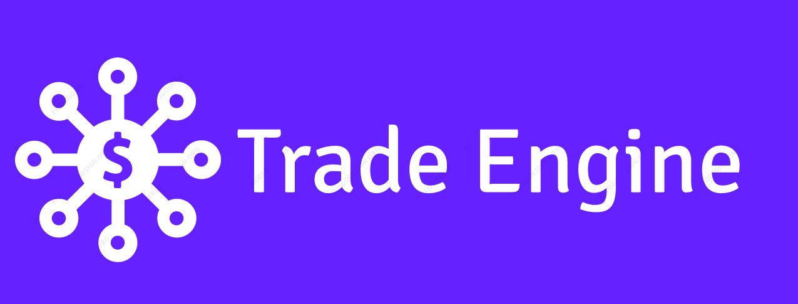

# Trade Engine

a library for demo trading | backtest and forward test simulation

## Features

# Requirements

# Getting start

# Contributing
Contributions are very welcome. There are a number of requirements:
* See Issues tab, and feel free to submit your own issues
* Add PRs if you discover a solution to an existing issue
* The code should be Pep8 compliant.
* Comments are required for every class and function and they should be a clear description.
* At least one broad test case and a set of unit tests must be provided for every function.
* Avoid very pythonic construction

# License
`trade-engine` is freely available under the MIT [license](https://github.com/xibalbas/trade-engine/blob/master/LICENSE).